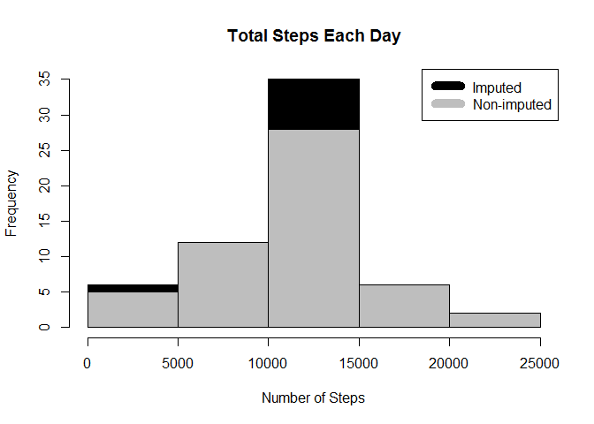

# Reproducible Research: Peer Assessment 1
Sudhakar Athuru  

## Loading and preprocessing the data
1. Load data form the .csv file


```r
setwd("C:/Sudhakar/coursera/05_ReproducibleResearch")
actdata <- read.csv("./data/activity.csv")
head(actdata)
```

```
##   steps       date interval
## 1    NA 2012-10-01        0
## 2    NA 2012-10-01        5
## 3    NA 2012-10-01       10
## 4    NA 2012-10-01       15
## 5    NA 2012-10-01       20
## 6    NA 2012-10-01       25
```

```r
names(actdata)
```

```
## [1] "steps"    "date"     "interval"
```

```r
summary(actdata)
```

```
##      steps                date          interval     
##  Min.   :  0.00   2012-10-01:  288   Min.   :   0.0  
##  1st Qu.:  0.00   2012-10-02:  288   1st Qu.: 588.8  
##  Median :  0.00   2012-10-03:  288   Median :1177.5  
##  Mean   : 37.38   2012-10-04:  288   Mean   :1177.5  
##  3rd Qu.: 12.00   2012-10-05:  288   3rd Qu.:1766.2  
##  Max.   :806.00   2012-10-06:  288   Max.   :2355.0  
##  NA's   :2304     (Other)   :15840
```

2. process data to aggregate steps per day

```r
steps_by_day <- aggregate(steps ~ date, actdata, sum)
head(steps_by_day)
```

```
##         date steps
## 1 2012-10-02   126
## 2 2012-10-03 11352
## 3 2012-10-04 12116
## 4 2012-10-05 13294
## 5 2012-10-06 15420
## 6 2012-10-07 11015
```

## What is mean total number of steps taken per day?
1. The following histogram shows number of total steps taken per day

```r
hist(steps_by_day$steps, main = paste("Total Steps Each Day"), col="blue", xlab="Number of Steps")
```

<!-- -->

2. Compute and print mean and median steps per day:

```r
###smean <- as.integer(mean(steps_by_day$steps))
smean <- mean(steps_by_day$steps)
smedian <- median(steps_by_day$steps)
```
Mean steps per day are 10766. Median steps per day are 10765.

## What is the average daily activity pattern?
1. Time series plot of the 5-minute interval (x-axis)and the average number of steps taken, averaged across all days (y-axis)process data to aggregate steps per day


```r
steps_by_interval <- aggregate(steps ~ interval, actdata, mean)
summary(steps_by_interval)
```

```
##     interval          steps        
##  Min.   :   0.0   Min.   :  0.000  
##  1st Qu.: 588.8   1st Qu.:  2.486  
##  Median :1177.5   Median : 34.113  
##  Mean   :1177.5   Mean   : 37.383  
##  3rd Qu.:1766.2   3rd Qu.: 52.835  
##  Max.   :2355.0   Max.   :206.170
```

```r
plot(steps_by_interval$interval,steps_by_interval$steps, type="l", xlab="Interval", ylab="Number of Steps",main="Average Number of Steps per Day by Interval")
```

<!-- -->

2. Which 5-minute interval, on average across all the days in the dataset,
contains the maximum number of steps?


```r
max_interval <- steps_by_interval[which.max(steps_by_interval$steps),1]
```

835 is the 5-minute interval with maximum number of steps.


## Imputing missing values

1. Calculate and report the total number of missing values in the dataset
(i.e. the total number of rows with NAs)

```r
missing <- sum(is.na(actdata))
```
There are a total of 2304 records with missing values in the activity data. 

2. Strategy to fill missing values in the dataset: Missing values were imputed by inserting the average for each interval.


```r
incomplete <- sum(!complete.cases(actdata))
imputed_data <- transform(actdata, steps = ifelse(is.na(actdata$steps), steps_by_interval$steps[match(actdata$interval, steps_by_interval$interval)], actdata$steps))
head(imputed_data)
```

```
##       steps       date interval
## 1 1.7169811 2012-10-01        0
## 2 0.3396226 2012-10-01        5
## 3 0.1320755 2012-10-01       10
## 4 0.1509434 2012-10-01       15
## 5 0.0754717 2012-10-01       20
## 6 2.0943396 2012-10-01       25
```

Zeroes were imputed for 10-01-2012. Missing values were assumed to be zeros to fit the rising trend of the data.


```r
imputed_data[as.character(imputed_data$date) == "2012-10-01", 1] <- 0
```

Recount total steps by day and create Histogram.

```r
steps_by_day_i <- aggregate(steps ~ date, imputed_data, sum)
hist(steps_by_day_i$steps, main = paste("Total Steps Each Day"), col="black", xlab="Number of Steps")

#Create Histogram to show difference. 
hist(steps_by_day$steps, main = paste("Total Steps Each Day"), col="gray", xlab="Number of Steps", add=T)
legend("topright", c("Imputed", "Non-imputed"), col=c("black", "gray"), lwd=10)
```

<!-- -->

Calculate new mean and median for imputed data.

```r
smean.i <- mean(steps_by_day_i$steps)
smedian.i <- median(steps_by_day_i$steps)
```

Calculate difference between imputed and non-imputed data.

```r
mean_diff <- smean.i - smean
med_diff <- smedian.i - smedian
```

Calculate total difference.

```r
total_diff <- as.integer(sum(steps_by_day_i$steps) - sum(steps_by_day$steps))
```

* The imputed data mean is 10589.
* The imputed data median 10766.
* The difference between the non-imputed mean and imputed mean is -176.4948964.
* The difference between the non-imputed median and imputed median is 1.1886792.
* The difference between total number of steps between imputed and non-imputed data is 75363. Hence, there were 75363 more steps in the imputed data.


## Are there differences in activity patterns between weekdays and weekends?

```r
weekdays <- c("Monday", "Tuesday", "Wednesday", "Thursday", "Friday")
imputed_data$dow = as.factor(ifelse(is.element(weekdays(as.Date(imputed_data$date)),weekdays), "Weekday", "Weekend"))
steps_by_interval_i <- aggregate(steps ~ interval + dow, imputed_data, mean)

library(lattice)
xyplot(steps_by_interval_i$steps ~ steps_by_interval_i$interval|steps_by_interval_i$dow, main="Average Steps per Day by Interval",xlab="Interval", ylab="Steps",layout=c(1,2), type="l")
```

<!-- -->

On weekdays, steps are higher during 6am to 9am compared to weekends at the same time. This shows that people are more active earlier in the day on weekdays then the activity goes down on weekdays after 10am most likely because they are in sedentary work environment during work day. 
